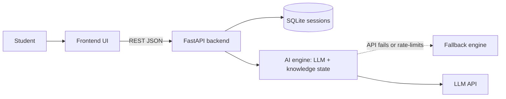

# Teachable AI Bot

An AI "student" that **you teach**. The bot learns from your explanation, asks follow-up questions, and is then quizzed using only what you taught it. Teaching helps you learn faster.

**Live demo:** <frontend link>
**API docs:** https://YOUR-APP.onrender.com/docs
**Demo video:** <link>

## How it works

1. Pick a topic (or type a custom one).
2. Teach the bot in the chat.
3. Watch the knowledge map change colors as the bot learns.
4. The bot asks follow-up questions about what you taught.
5. Quiz the bot. It answers only from what you taught it.
6. Get a teaching report card.

**Knowledge map colors:** grey = unknown, yellow = partial, green = correct, red = misconception.

## Architecture



| Layer | Owner | What it does |
|---|---|---|
| Frontend | Sankur | Chat, knowledge map, quiz, report card |
| AI engine | Tisha | Concept extraction, knowledge state, follow-up questions, quiz, scoring |
| Backend | Dipan | API, session storage, topics, deployment |

## Tech stack

- Frontend: <Sankur to fill>
- Backend: Python, FastAPI, SQLite
- AI: <Tisha to fill: model name>
- Hosting: Render (backend) and <frontend host>

## API

| Method | Endpoint | Purpose |
|---|---|---|
| GET | `/health` | Server check |
| GET | `/api/topics` | Preset topics |
| POST | `/api/session` | Start session `{topic_id}` |
| POST | `/api/session/custom` | Start custom topic `{topic}` |
| POST | `/api/teach` | Teach the bot `{session_id, message}` |
| POST | `/api/quiz` | Quiz the bot `{session_id}` |
| POST | `/api/report` | Teaching report `{session_id}` |
| GET | `/api/session/{id}` | Session with chat history |
| GET | `/api/history` | Past sessions |

Full interactive docs: `/docs`

## Reliability

- The backend retries the LLM once.
- If it still fails, a simple fallback engine takes over, so the demo never breaks.
- Responses include `"fallback": true/false`.
- Set `FORCE_FALLBACK=1` to force the fallback.

## Run locally

```bash
cd backend
python -m venv venv
venv\Scripts\activate        # Mac/Linux: source venv/bin/activate
pip install -r requirements.txt
copy .env.example .env       # Mac/Linux: cp .env.example .env
uvicorn main:app --reload --port 8000
```

Open http://localhost:8000/docs

## Environment variables

| Name | Purpose |
|---|---|
| `LLM_API_KEY` | LLM provider key |
| `ALLOWED_ORIGINS` | CORS origins (`*` for demo) |
| `DB_PATH` | SQLite file path |
| `FORCE_FALLBACK` | `1` to use the fallback engine |

## Team

- Sankur: Frontend, UX, demo video
- Tisha: AI engine
- Dipan: Backend, data, deployment, docs